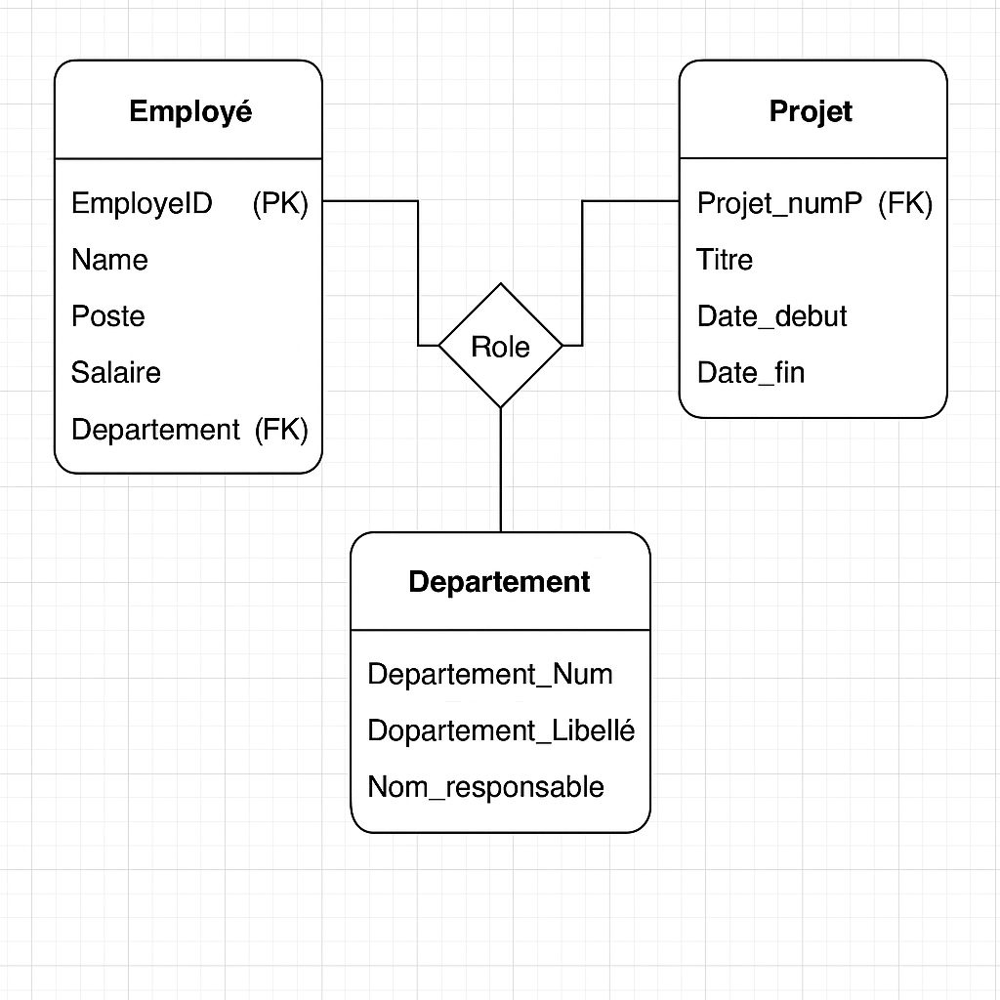

# 📌 Activité : Modélisation et Implémentation d'une Base de Données en SQL

## 🎯 Objectif

Concevoir et mettre en œuvre le schéma de base de données pour un **système d'information sur la participation des salariés**, à partir des modèles conceptuel et relationnel développés en amont.

---

## 📝 Instructions

### 1. Compréhension du système

Le système est basé sur les entités et relations suivantes :

- **Employé** : 
  - Informations : numéro, nom, poste, salaire, service (département) de rattachement.
  
- **Département** : 
  - Informations : numéro, libellé, nom du responsable.
  
- **Projet** : 
  - Informations : numéro, titre, date de début, date de fin, département affecté.
  
- **Participation des employés aux projets** : 
  - Informations : rôle de l’employé dans un projet.

---

### 2. Tables à créer

- `Departement`
- `Employé`
- `Projet`
- `Role` (pour gérer la participation des employés aux projets)

---

## 🗃️ Spécifications Techniques

### Clés primaires et étrangères

- Chaque table doit avoir une **clé primaire** (`PRIMARY KEY`) pour l’identification unique des enregistrements.
- Les relations entre les tables sont assurées par des **clés étrangères** (`FOREIGN KEY`) pour garantir l'intégrité référentielle.

---

## 🛠️ Script SQL

```sql
-- Création de la base de données
CREATE DATABASE CheckpointDB;
GO

-- Sélection de la base
USE CheckpointDB;
GO

-- Table Département
CREATE TABLE Departement (
    Departement_Num INT PRIMARY KEY,
    Departement_Libellé VARCHAR(50),
    Nom_responsable VARCHAR(50)
);
GO

-- Table Employé
CREATE TABLE Employé (
    EmployeID INT PRIMARY KEY,
    Name VARCHAR(50),
    Poste VARCHAR(50),
    Salaire DECIMAL(38,1),
    Service VARCHAR(50),
    Departement_Num INT,
    FOREIGN KEY (Departement_Num) REFERENCES Departement(Departement_Num)
);
GO

-- Table Projet
CREATE TABLE Projet (
    Projet_numP INT PRIMARY KEY,
    Titre VARCHAR(50),
    Date_debut DATE,
    Date_fin DATE,
    Departement_Num INT,
    FOREIGN KEY (Departement_Num) REFERENCES Departement(Departement_Num)
);
GO

-- Table Role (Participation des employés aux projets)
CREATE TABLE Role (
    Projet_numP INT,
    FOREIGN KEY (Projet_numP) REFERENCES Projet(Projet_NumP),
    EmployeID INT,
    FOREIGN KEY (EmployeID) REFERENCES Employé(EmployeID),
    Role_employé VARCHAR(50),
    PRIMARY KEY (Projet_numP, EmployeID)
);
GO
```
---

# 🗂️ Diagramme Entité-Relation

Voici le schéma visuel représentant les relations entre les entités :

